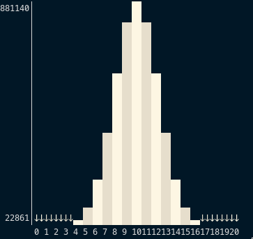
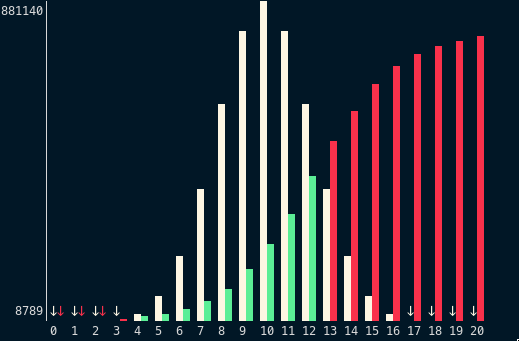

# chart-relative
A library and CLI tool for generating compact text-based charts.

[](https://crates.io/crates/chart-relative)
[](https://docs.rs/chart-relative)
[](https://github.com/guapodero/chart-relative/actions)

## Why
I needed a simple way to visualize a small distribution of word counts and the effect of applying a filter.

## Goals
* Text output
* Indicate outliers
* Maximize information density

## CLI
```txt
USAGE:
  chart-relative  [--max-height u16] [( --view-bottom | --view-top )]

  [--max-height u16]               Maximum number of lines to use for display before scaling. default: 16
  [( --view-bottom | --view-top )] Which end of range to show, if too large to show all. default: bottom


Standard Input:

    The standard input stream should contain 1-3 columns, separated by spaces.
    Input is truncated after 100 lines.

    Either:

    1. Only data
    integer

    2. Labeled data
    integer string

    3. Unlabeled comparison data
    integer integer

    4. Labeled comparison data
    integer integer string
```

## Examples

```echo "4 104 889 5517 22861 73805 184473 369441 599945 800265 881140 801904 600813 370368 185082 73635 23325 5399 931 95 4" | tr ' ' '\n' | chart-relative --view-top```



```printf '%s\n' "4 1978" "104 3256" "889 5354" "5517 8789" "22861 14388" "73805 23449" "184473 37940" "369441 60686" "599945 95362" "800265 145940" "881140 215153" "801904 302032" "600813 400000" "370368 497967" "185082 584846" "73635 654059" "23325 704637" "5399 739313" "931 762059" "95 776550" "4 785611" | chart-relative --view-top```



More examples are available by running the tests.
`cargo test -- --nocapture`

## Related Work
[lowcharts](https://crates.io/crates/lowcharts) can also be used to generate bar charts, and
is more suitable for general purpose use. In contrast, chart-relative is useful for comparing
two related data sets which may contain outliers.

## Installation

### Cargo

* Install the rust toolchain in order to have cargo installed by following
  [this](https://www.rust-lang.org/tools/install) guide.
* run `cargo install chart-relative`

## License

Licensed under either of

 * Apache License, Version 2.0
   ([LICENSE-APACHE](LICENSE-APACHE) or http://www.apache.org/licenses/LICENSE-2.0)
 * MIT license
   ([LICENSE-MIT](LICENSE-MIT) or http://opensource.org/licenses/MIT)

at your option.

## Contribution

Unless you explicitly state otherwise, any contribution intentionally submitted
for inclusion in the work by you, as defined in the Apache-2.0 license, shall be
dual licensed as above, without any additional terms or conditions.

See [CONTRIBUTING.md](CONTRIBUTING.md).
